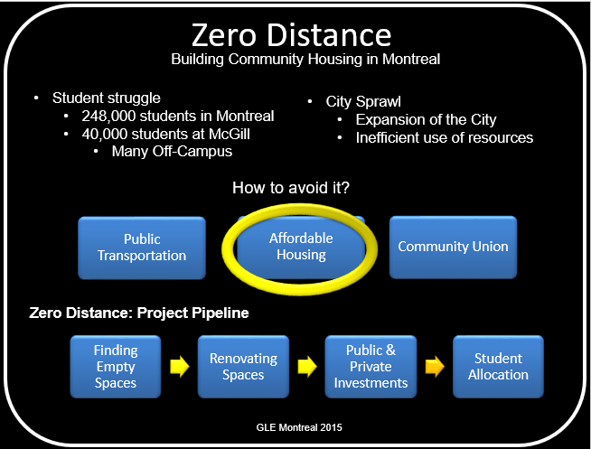

# Zero Distance

### GLE Montreal 2015
---

This week I attended the 4-day conference organized by the UK-based Common Purpose organization. The conference was meant to be 4 full-time days, but due to my responsibilities at work, I missed about 40% of the event. 

The event is targeted to university students of all levels who aspire to be leaders. The 2015 Montreal edition had close to 90 students from different universities, different majors, and different nationalities. It is the perfect example of bringing together a collective group of diverse backgrounds together to solve some of the hardest problems on Earth. The topic of this year's event was "City Sprawl", especially the challenge of city sprawl in Montreal. 

We gathered together in 6 different groups and collectively proposed the following projects:

* Zero Distance
* PANGAEA: Bringing everyone together
* Bridging Gaps
* Community Food Hubs
* Community Network Solution
* Local Outreach empOwering People
* Mutual Learning Cooperative

### Zero Distance
---

In the spirit of proposing solutions to Montreal's city sprawl, my team studied several solutions to the city sprawl challenge. 

We decided to tackle one of Montreal's top problems: affordable housing for students. The team was composed of members from the following backgrounds:

* General Management, McGill
* Computer Science & Mathematics, McGill
* Educational Leadership, McGill
* Political Science, Concordia
* Economics, McGill
* International Business, UQAM

This proposed solution is relevant to Montreal since it has a student population of more than 248,000 students, many living off-campus. Therefore, we proposed the project Zero Distance which aims to renovate and transform neglected property into liveable, affordable and communal living spaces for students with the help of investors who will also benefit by the increase in the number of clientele, increased positive reputation, and better brand awareness. We strongly believe that Zero Distance will prevent city sprawl, because not only is it replicable, but also very relevant and relational to other magnet cities.

We presented a 1-min video pitch and a 3-min pitch in front of a panel of 3 judges. Overall, it was an amazing experience and it was a great team effort. The question now is whether we will pursue this idea forward or not. The idea will stand by until next year. 